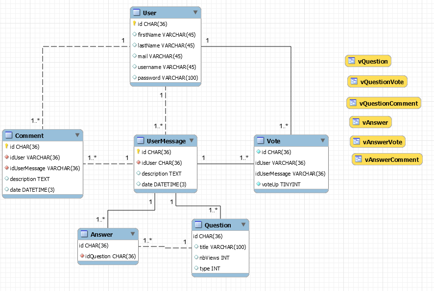

# AMT Project 1 : StoneOverflow 

## Table of contents
- [Introduction](#Introduction)  
- [SQL Schema](#SQL-Schema)  
- [Deployment](#Deployment)
- [Tests](#Tests)
- [Gamification Implementation](#Gamification-Implementation)
- [Known Problems](#Known-Problems)

## Introduction
As part of the course AMT, we were asked to create a site that will be a simple version of Stack Overflow. We will have to use the Jakarta EE technology to be able to create a site using Java language.

We will also use JUnit for the UnitTest and Codecept.js for the e2e tests.

If you want to see the specification of the user interface please [click here](https://docs.google.com/document/d/1DSahosKDQq_0yjQDg7r0EOaPcs6QhwXc7yyWqTjHFSo/edit?usp=sharing)

## SQL Schema

The project contains an SQL database and below you will see the different tables and views used in this database.



## Deployment
The web application can be deployed with a simple [docker-compose](./docker/docker-compose.yml) file.

First clone the repository.
```
git clone https://github.com/RockAndStones/AMT-Project-1.git
```
Next, open a terminal in the docker folder of the cloned repository and run the following command.
```
docker-compose up -d
```
You will then be able to access the web application at the URL http://localhost:8080 when docker-compose is up and running.

## Tests
If you want to run the tests you will first need to clone the repository here is the command.

```
git clone https://github.com/RockAndStones/AMT-Project-1.git
```
### Unit & Integration Tests
To run the unit & integration tests, use the `run-unit-integration-tests.sh` script from the cloned root folder.
### End to End (E2E) Tests
To run the end to end (E2E) tests, use the `run-e2e-tests.sh` script from the cloned root folder.

### Gamification Implementation
In the last part of the semester, we were asked to merge the two projects created in this course, the StoneOverflow and the gamification engine.  
To create a connection between the two applications, we created a new class named `GamificationFacade` in the application/gamification package. This class will make the different calls for the API.  
With this class we created another class named `GamificationHelper` that will contain all the rules, badges, and point scales that we will generate on the API for our site.  
The calls of the functions on the `GamificationFacade` will be made by other Facades when we will need to add or remove points on different scales. But some servlets, for instance, StatiticServlet and HistoryServlet, will call directly the facade to make get calls for their respective pages.  
To create the different calls function to the API we generated the code with the openAPI generator and the YAML file of our gamification engine.  

Of course, once the facade was created, we added a few more integration tests to make sure the facade is working as planned.  
We tested that we could make all the calls needed to the API and receives a response. The intergration phase was tested using Arquillian as well.

## Known Problems
- The tag functionality is implemented and tested but, we did not have the time to implement it in the UI.
